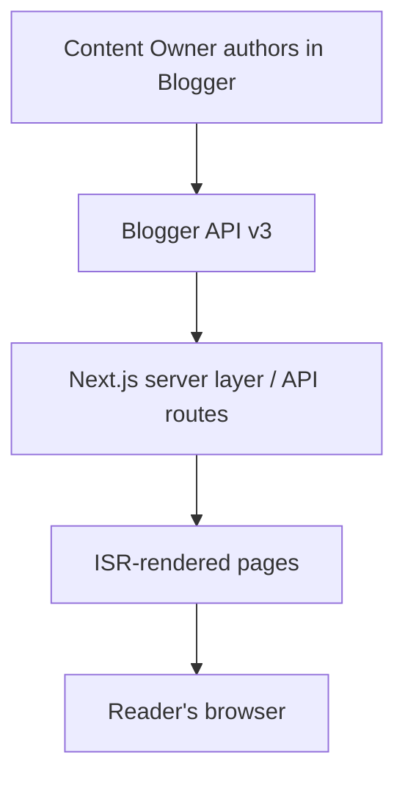

# Vision Document — kkn-badko-blog

**Version:** 1.0 | **Date:** 2026-06-29 | **Author:** Developer (project owner) | **Software/Project:** Fullstack Blog Website (Next.js + Blogger API)

> Grounded in `PROJECT_PLAN.md`. Items not stated there are flagged `[CONTEXT-GAP: …]` and must be filled by the stakeholder before downstream SRS skills run.

## Executive Summary

This vision defines a fullstack blog website built with **Next.js** that sources and renders content through the **Google Blogger API**. The system delivers a fast, SEO-friendly reading experience with an admin-friendly publishing flow (content is authored in Blogger and surfaced on the site). The work is phase-gated across 3 phases / 200 hours: requirement gathering (20 h), website building (160 h), and stakeholder socialization (20 h), targeting a ~5–6 week calendar duration.

`[CONTEXT-GAP: target ROI / revenue impact not stated in PROJECT_PLAN.md]`

---

## 1. Problem Statement

**Current State:** Stakeholders need a public blog with a clean reading experience while keeping content authoring in Blogger.
**Impact:** `[CONTEXT-GAP: quantified business consequences (e.g., lost reach, manual effort) not stated]`
**Root Causes:** `[CONTEXT-GAP: specific process/tool gaps not stated]`

---

## 2. Stakeholder Map

| Stakeholder Group | Key Roles | Primary Concerns | Success Metrics | Influence Level | Engagement Plan |
|-------------------|-----------|------------------|-----------------|-----------------|-----------------|
| Business | Project Owner / Stakeholder | Scope, milestones, final sign-off | Milestones M1–M5 approved | High | Milestone reviews |
| Technical | Developer | Architecture, build, deploy | Site live with CI/CD | High | Builds the system |
| Content | Content Owner | Publishing flow, Blogger account | Posts publish to site correctly | Medium | Publishing walkthrough |
| Quality | Reviewer / QA | Features match requirements | QA passes vs. Phase 1 requirements | Medium | Test/requirements reviews |

_Stakeholders are identified by role only (decided); names to be added later._

**Stakeholder Analysis:** Owner and developer are high power/high interest; content owner and QA are medium. Engagement centers on the five milestone sign-offs.

---

## 3. Business Objectives

| Objective ID | Objective Statement | Key Results (OKRs) | Priority | Timeframe |
|--------------|---------------------|--------------------|----------|-----------|
| OBJ-001 | Launch a fast, SEO-friendly blog | Lighthouse + SEO basics pass before launch | High | Phase 2 (M4) |
| OBJ-002 | Keep content authoring in Blogger | Posts published in Blogger appear on site via API | High | Phase 2 |
| OBJ-003 | Stakeholders can operate/maintain the site | Training delivered; handover signed | High | Phase 3 (M5) |

---

## 4. Solution Vision

**Key Capabilities:**
- Blog post list, detail pages, pagination sourced from Blogger API
- Search, labels/categories, comments
- Responsive, accessible, SEO-optimized reading experience

**Deployment Model:** Cloud (Vercel recommended) with CI/CD.

---

## 5. Fit Criteria (Measurable Success Measures)

| Criteria ID | Statement | Measurement Method | Target | Validation Owner | Status |
|-------------|-----------|--------------------|--------|------------------|--------|
| FIT-001 | Blog renders Blogger posts (list, detail, pagination) | Functional test vs. live API | 100% of features work | Reviewer/QA | [ ] TBD |
| FIT-002 | Search + labels/categories + post pages work | Functional test | All pass | Reviewer/QA | [ ] TBD |
| FIT-003 | Responsive across mobile/tablet/desktop | Device/viewport testing | Passes on all 3 | Reviewer/QA | [ ] TBD |
| FIT-004 | SEO basics present | Inspect meta/sitemap/OG/JSON-LD | All present | Developer | [ ] TBD |
| FIT-005 | Deployed to public URL with CI/CD | Production deploy verification | Live + pipeline green | Stakeholder | [ ] TBD |
| FIT-006 | Performance verified | Lighthouse audit (Phase 2.4) | Performance ≥ 90 | Developer | [ ] TBD |
| FIT-007 | Accessibility verified | Accessibility audit (Phase 2.3.4) | WCAG 2.1 AA | Developer | [ ] TBD |

**Acceptance Gates:** Go/No-Go at milestones M1 (requirements), M4 (production live), M5 (sign-off).

---

## 6. Scope Boundaries

### In Scope
- Post list with pagination, single post page, labels/categories, search
- Comments integration, About + Contact pages
- Responsive design, SEO basics, deployment with CI/CD

### Out of Scope
- Native mobile app
- Multi-language i18n
- Paid subscriptions
- Custom CMS replacing Blogger

### Minimum Viable Product (MVP)
| Feature | Priority | MVP Status |
|---------|----------|------------|
| Post list + pagination | High | INCLUDED |
| Single post page | High | INCLUDED |
| Labels/categories | High | INCLUDED |
| Search | High | INCLUDED |
| Comments | Medium | INCLUDED |
| About / Contact | Medium | INCLUDED |

---

## 7. Key Metrics & KPIs

| Category | Metric | Baseline | Target | Frequency |
|----------|--------|----------|--------|-----------|
| Performance | Lighthouse performance | n/a | ≥ 90 | Per release |
| SEO | SEO basics coverage | n/a | meta + sitemap + OG + JSON-LD | Per release |
| Delivery | Phase completion | n/a | M1–M5 on schedule | Per milestone |
| Reliability | Uptime | n/a | Best-effort (Vercel default) | Monthly |

---

## 8. Risks & Mitigation

| Risk ID | Description | Probability | Impact | Mitigation | Owner |
|---------|-------------|-------------|--------|-----------|-------|
| RISK-001 | Blogger API quota limits | Medium | Medium | Cache + ISR; minimize live calls | Developer |
| RISK-002 | API auth/credential delays | High | High | Secure access during Phase 1.3 | Developer |
| RISK-003 | Scope creep | High | High | Lock scope at M1; re-estimate changes | Stakeholder |
| RISK-004 | Content not ready at launch | Medium | Medium | Seed content; content-owner timeline | Content Owner |
| RISK-005 | Performance/SEO gaps | Medium | Medium | Lighthouse audit in 2.4 before launch | Developer |

---

## 9. Timeline & Milestones

| Phase | Key Deliverables | Date | Dependencies | Status |
|-------|------------------|------|--------------|--------|
| Phase 1 — Requirements | Approved requirements doc, wireframes, API creds | Week 1 | Stakeholder alignment | [ ] Not Started |
| Phase 2 — Build | Working deployed site, tests, CI/CD | Weeks 2–5 | Requirements approved | [ ] Not Started |
| Phase 3 — Socialization | Docs, training, signed handover | Week 6 | Production live | [ ] Not Started |

`[CONTEXT-GAP: absolute calendar dates not provided — weeks are relative to project start]`

---

## 10. Glossary

See `_context/glossary.md`.

---

## Approval Signatures

| Role | Name | Signature | Date | Approved |
|------|------|-----------|------|----------|
| Project Owner / Stakeholder | | | | [ ] Yes [ ] No |
| Developer | | | | [ ] Yes [ ] No |
| Reviewer / QA | | | | [ ] Yes [ ] No |

---

**Document Control:**
- **Change History:** v1.0 — initial seed from PROJECT_PLAN.md (2026-06-29)
- **Next Review:** Milestone M1
- **Distribution List:** Project stakeholders
